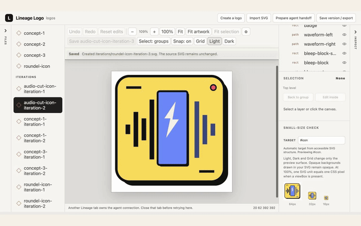

# Lineage Logo

A shared visual canvas where you and your agent create and fine-tune SVG logos together.

Lock in the big picture design of your logo using [the logo design skill](https://github.com/neonwatty/logo-designer-skill), and bring it into the Lineage Logo studio to fine tune shapes, sizes, colors, spacing, etc., manaually or with your agent.

[](https://lineagehq.github.io/lineage-logo/#polish)

## Get started

Requires Node.js 22+ on macOS or Linux.

Put your SVG in the `concepts/` subfolder of a logo workspace, then run:

```bash
npx lineage-logo@0.1.0-beta.4 launch --workspace /absolute/path/to/logos
```

Replace the path with your workspace. Open the `lineage-logo.localhost` address printed by the launcher and keep the terminal running while you edit.

[Try the included example](docs/public-beta/seatify-quickstart.md) · [Connect your agent](docs/public-beta/agent-proposals.md)

## Learn more

- [Manual editing walkthrough](https://github.com/neonwatty/logo-designer-skill/blob/main/docs/manual-tweaks.md)
- [Agent integration](docs/agent-canvas.md)
- [Development and technical reference](docs/technical-reference.md)
- [Public beta release notes](docs/public-beta/release-notes-beta.4.md)
- [Support and feedback](SUPPORT.md)
