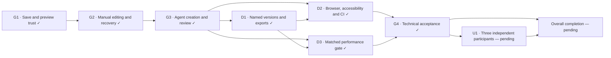

# Execution v1 — technical completion; independent usability pending

**G4 technical acceptance passed at main commit `94e82f0a20f0cce3e23f06a66f669e55cf0a88db`. U1 and overall completion remain pending.** The user deferred VoiceOver on September 7, 2026; its result is unverified. Automated accessibility requirements remain satisfied within their documented scope.

This is a completion overview. The full node dependencies and acceptance contracts remain in `graph.json` and `plan.md`.

| Acceptance area | Evidence and outcome |
| --- | --- |
| Agent creation, structural review/revision, preserving follow-up and manual finishing | Installed public CLI/UI oracle; exact reopen, original-byte integrity and transaction checks passed. `evidence/g4-installed.json` |
| Save, recovery and failure handling | Stale/locked refusal, offline review restoration and HTTP 503 before durable write with a single successful retry artifact passed. `evidence/g4-final-local.json` |
| Named versions and asset export | Independent SVG parsing, PNG decoding and bounds/paint/resource assertions; three SVG and 27 PNG hashes recorded. `evidence/d1.json`, `evidence/g4-installed.json` |
| Local and main browser checks | macOS and Linux each passed 129 cases locally; main passed 123 Chromium plus three Firefox and three WebKit cases, with no failures or skips. |
| Unit, installation and compatibility | Main passed 783 unit tests; the browser-dependent case omitted from unit-only runs passed separately. Typecheck/build, production audit, Node 22/24 and Ubuntu/macOS clean installation passed. |
| Accessibility and corpus | Eight axe states have no serious/critical findings; keyboard/focus/zoom checks passed. All 15 full-corpus cases passed on main. Real assistive technology remains deferred and unverified. |
| Performance | All 15 matched B0/candidate comparisons and 500-layer budgets passed. Raw samples, outliers and bounded heap trends are retained in `evidence/d3/`. CI measurements are not substituted for this controlled gate. |
| Main integration | PR38 and PR39 merged; main CI, CodeQL and extended workflow passed. Exact merge/run identities are in `evidence/g4.json`. |

The final main package SHA-256 is `efb1a6d0dc2dd7fe68db7a50dcbbdcd11b8474bd25bc0605f78a17f52fa6a8cf`. Local clean installation and all three main CI package receipts match the installed oracle and measured runtime package. Later changes affect only tests, workflows and maintainer evidence.

The first extended workflow run exposed an unconditional artifact upload after successful tests had intentionally removed diagnostics. PR39 corrected the upload condition to preserve the failure-only policy. Eleven focused tests, independent review and successful branch/main dispatches verify the fix; the failed run remains recorded.

The `usability-study/` kit is preparation only. Candidate binding, deterministic study assets and a non-counting rehearsal must be finalized before three user-arranged independent people perform the study. No real participants, observations or success receipts have been invented. VoiceOver deferral does not waive U1. No publication, deployment or participant outreach occurred.
