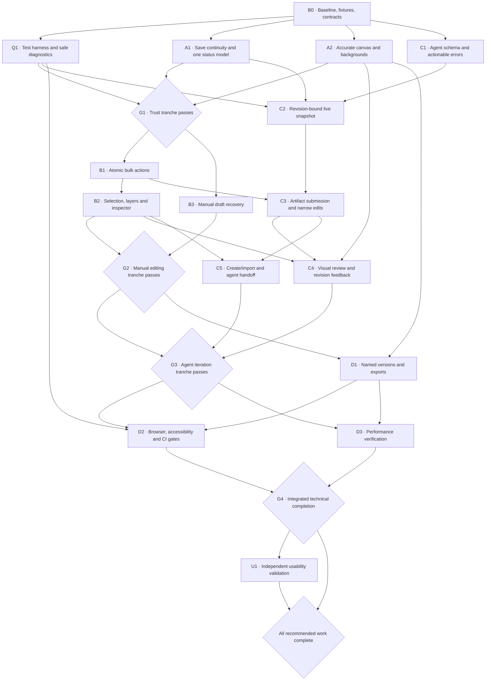

# Logo workflow improvements — execution plan v1

Prepared 2026-09-06 from the [app audit](../../audits/ux-testing-ci-2026-09-06.md), grounded in commit `fbfa870c0f7fb174c58fbb34e3fa0531e8971770`.

**Status:** execution authorized by the user: “Approve plan v1 and execute, including merging qualifying PRs.” Approval is recorded in `graph.json`; node status and evidence track actual implementation. No future CI or independent-user result is implied. The audit's 548 unit/integration tests, 48 Chromium scenarios, two browser smoke checks, and green main CI are the historical baseline, not completion evidence for this plan.

## Dependency graph

Arrows are required completion dependencies. Branches that separate can be developed concurrently subject to the ownership rules below. Gates are evidence checks, not recurring requests for user approval. The graph expresses ordering, not elapsed time or staffing estimates.

The machine-readable [graph and receipt skeleton](graph.json) use these same node IDs and dependencies. Node acceptance criteria below are authoritative; a graph checkbox alone cannot complete a node.

## Parallel execution and PR boundaries

| Window | Parallel work | Required coordination |
| --- | --- | --- |
| After B0 | A1 lifecycle; A2 preview; C1 CLI; Q1 QA infrastructure | Four logical lanes, not four unrestricted writers. One integration owner controls shared files. |
| After A1/C1/Q1 | C2 can start while preview or G1 work finishes | Freeze snapshot and saved-baseline identities before API work. |
| After G1 | B1 bulk operations and B3 recovery; C2 where ready | B3 owns persistence module; B1 owns canvas mutation code. Main-file wiring is serialized. |
| After B1 | B2 editing UX and C3 producer operations | C3 owns protocol/server/producer modules; canvas adapter changes go through the B1/B2 owner. |
| After G2 and C3 | C4 review and C5 onboarding; D1 export | Separate review/onboarding/export modules; one main/CSS integrator. |
| After G3 and D1 | D2 broad QA and D3 performance | Separate test files and workloads; never run competing benchmarks or fixed-port suites on the same machine. |

Use fresh `codex/` worktrees and narrow PRs. Prefer one node per PR; split a large node into explicitly listed child PRs without marking the node complete until every criterion passes. A1 deliberately combines save continuity and status unification because both modify the same baseline transitions. B2 follows B1 to avoid simultaneous edits to the same selection/control code.

The integration owner owns `src/client/main.ts`, `src/client/styles.css`, and final wiring in `src/client/canvas/editor.ts`. Other owners propose small integration patches or coordinate a temporary exclusive lease. No two active writers own the same file. Test harness configuration, dependency files, and CI workflows also have one owner. Shared-file refactoring is incremental and behavior-preserving; this is not permission for a framework rewrite.

For stacked PRs, record the parent branch and commit. Rebase/retarget after the parent lands and rerun applicable checks against the new head. A green stacked parent does not make its child green. Product dependencies must be accepted on the branch under test before downstream work is called integrated.

## Rules applying to every node

1. **Evidence:** identify the base and tested commit, source anchor, affected files, explicit assertions, fixtures, command/test names, local result, PR URL, CI run URL and head SHA, and remaining limitations. Use the receipt structure in `graph.json`. Never replace an expected result with a status word such as “looks good.”
2. **Tests exercise the app:** use actual UI controls, supported CLI/API boundaries, clean saved files, rendered geometry, and process restart. Test pure math/parsing in unit tests. Do not count source-string matching, disconnected mock snapshots, hidden editor mutations, or rename-only proposals as end-to-end design evidence.
3. **Regression oracle:** for reproduced defects, demonstrate the relevant assertion fails on the old implementation and passes on the fix where practical. Keep characterization or intentionally failing experiments off green merge branches. For new features, specify outputs and rejection cases before implementation.
4. **Integrity:** saved originals are byte-identical; saved outputs are clean valid SVG with intact IDs/local references; rejected/no-op actions do not alter document/history; successful logical actions have the specified undo behavior. Export/preview operations never mutate accepted artwork. Pending proposals cannot bypass review. Keep existing validation/redaction and multi-editor isolation invariants.
5. **Visual evidence:** capture only public/synthetic fixtures. Verify foreground/background pixels, document bounds, selected objects, and control reachability. Use fixed fonts/viewports and inspect visual baseline changes; never update screenshots solely to make CI pass.
6. **State coverage:** include normal, invalid, no-op, locked, stale, disconnected, failed-save, and cancellation paths where they apply. Not every node needs every failure scenario, but every omitted relevant case needs a reason.
7. **Run policy:** focused checks during development; before PR completion run `npm run check` and affected browser journeys. Before each tranche gate run the full Chromium suite and critical Firefox/WebKit suite plus that tranche's integrated journey. Preserve all existing CI jobs. Added suites must be wired into an explicit PR or candidate gate, not left as unused files.
8. **CI:** inspect all expected jobs at the current PR head; wait for terminal results, diagnose failures, fix and push, then inspect the new head. Missing/skipped required jobs are not success. One documented retry is reasonable for a demonstrated infrastructure failure; repeated attempts do not erase a flaky product test. Do not weaken assertions, silently quarantine tests, bypass required reviews, or change branch protection to achieve green.
9. **Review and merge:** review the complete diff and affected invariants, resolve actionable findings, and follow repository rules. Under the approval block below, merge only when dependencies, node criteria, required checks, and required reviews are satisfied. Then inspect main CI for the merge commit and fix regressions before the next gate.
10. **Local operation:** use descriptive `.localhost` addresses; isolate workspaces, instance registries, ports, and generated artifacts. The existing E2E harness has fixed ports, so separate worktrees do not make simultaneous full-suite runs safe. Serialize those suites unless Q1 introduces verified isolation. Clean up only task-owned processes/files and preserve the user's working tree.

## Node acceptance contracts

Each node requires its own contract plus the common rules. The proposed new test names are specifications, not claims that those tests already exist.

### B0 — Capture the baseline and freeze contracts

**Depends on:** none. **Grounding:** audit evidence; `package.json`, `playwright.config.ts`, `tests/e2e`, `src/client/main.ts`, and `src/shared/agent-protocol.ts`.

- Refresh main in a clean worktree; record revision, installed package versions, operating system, Node/browser versions, CI jobs, and actual branch-review requirements. Reconcile changes since the audited commit before editing.
- Establish a fixture manifest with content hashes: canonical 44-layer Seatify, complex transformed Seatify, wide/tall SVGs, transparent white/dark marks, authored background, inherited paint, gradients/masks/use, text-heavy, unnamed layers, empty and unsafe/malformed inputs. Add deterministic 100/500/1000-layer fixtures for D3.
- Record baseline measurements for load, selection, filtering, drag and preview update on the fixed performance environment. Specify the measured interval and number of samples, not just tool runtime.
- Write transition contracts for saved/dirty/pending/provisional/recovery state; save/reset semantics; revision/snapshot identity; bulk parent/child normalization; preview/export bounds; and feature ownership. Record any compatibility decisions.
- Verify the historical defects still reproduce or document their upstream fixes. The baseline suite must run successfully, or each pre-existing failure must be resolved before its dependent gate passes.

**Receipt:** baseline manifest, measurements, reproduction notes, contract document, CI inventory and ownership map. No implementation completion is inferred from B0.

### Q1 — Build useful, safe QA evidence

**Depends on:** B0. **Grounding:** `playwright.config.ts`, both E2E reporters, `scripts/e2e-server.ts`, and the single halo screenshot assertion.

- Add fixture-driven helpers and initial full-surface visual checks, without reaching into private editor state to perform actions. Expose semantic controls where needed.
- Default diagnostics contain test counts, durations, bounded categories, and static identifiers; never private paths, SVG payloads or credentials. Explicit rich diagnostics operate only on a validated public/synthetic fixture workspace. Unknown or user workspaces fail closed.
- Prove this policy with seeded path/token/content canaries and a forced failed test: default outputs contain none; public-fixture rich mode yields a usable artifact; private/unknown mode refuses capture. Failure cleanup must not erase the sanitized failure receipt.
- Verify harness startup/teardown, occupied-port behavior and concurrent-run isolation if added. No leaked child processes or fixture mutations.
- Add superseded-PR cancellation without canceling protected publishing or independent branch runs. Replace touched behavior-critical source-text assertions with mounted/UI assertions.

**Receipt:** successful normal run, deliberately induced failure receipt, canary results, visual baseline review and teardown proof. This node owns harness/config/dependency changes.

### A1 — Save continuity and consistent document state

**Depends on:** B0. **Grounding:** `main.ts:2081`, `main.ts:905`, `canvas/editor.ts:1333`; workspace and durable-save browser tests.

- Select/drill into a layer, lock another, change text and geometry, set nondefault zoom/pan, and save. Active file and saved baseline advance; selection, scope, locks, viewport and history survive.
- Edit again; Undo across the save boundary and Redo restore exact expected geometry/text/selection. The saved file itself does not change. Dirty status reflects comparison with the latest saved baseline. Reset restores that baseline using the documented undo policy.
- Repeated/in-flight saves cannot silently lose a later edit or create accidental duplicate continuations. Test slow save, failed write, a new edit during save, and an agent proposal arriving around save completion.
- After manual save, agent accept, Undo/Redo, reset, failed save, reconnect and recovery, footer/banner/review state and enabled actions agree. A provisional state is never labeled durably saved.
- Reopen the saved file after restarting the local process. Compare expected content and unchanged original bytes.

**Receipt:** `manual-save-continuity` and `document-state-consistency` browser evidence, save-race integration results, saved-file hashes. Extract the smallest useful lifecycle/baseline module while preserving behavior.

### A2 — Accurate document bounds and preview surfaces

**Depends on:** B0. **Grounding:** `styles.css:109–125`, `main.ts:2063`, `preview.ts`.

- Wide/tall fixtures display the correct document aspect ratio, without distortion; document bounds and pasteboard are distinguishable. Fit document and Fit artwork have different, correct bounds; zoom labels have documented meaning.
- Light/dark/transparency change the actual surface behind transparent art and the 64/32/16px previews. An authored opaque background remains intact and its effect is explained without pretending transparency exists.
- Preview target changes, background changes and fitting preserve clean SVG bytes, history, dirty state and selection.
- Pixel/rendered-bounds assertions prove the white mark is visible on dark, dark mark on light, and transparent/opaque cases differ as expected at 1280×720 and 760×720. Existing marquee/transform mapping still passes under changed board geometry.

**Receipt:** reviewed visual baselines, before/after serialization hashes, full transform regression result. Main/CSS integration is coordinated with A1.

### B1 — Complete atomic bulk editing

**Depends on:** G1. **Grounding:** `canvas/editor.ts:3393`, collective arrangement/transform tests.

- Two siblings and cross-parent selections support fill, stroke, stroke width, opacity, delete, duplicate and visibility as applicable. Mixed values are honestly represented; changing one property leaves others unchanged.
- Define and test group-vs-descendant paint semantics and normalize ancestor/descendant selections so no node is transformed, deleted or duplicated twice. Duplicated IDs and local references remain valid and paint order is preserved.
- Each successful action creates one history step; Undo/Redo restore structure, selection and appearance. Invalid paint/number, no-op, lock/ancestor lock, unsafe reference damage or pending review yields zero partial changes and an actionable explanation.
- Keyboard and inspector actions agree. Save/restart/reopen verifies clean results and original-byte preservation. Existing collective transform behavior remains intact.

**Receipt:** `bulk-actions` tests plus cross-parent and referenced-resource fixtures. Ownership: canvas mutation module and dedicated tests.

### B2 — Stable selection, layers and inspector

**Depends on:** B1. **Grounding:** `main.ts:1464`, `ui/inspector.ts`, layout controller and sidebar styles.

- Resizable panels have usable bounded widths; compact layer rows keep full names accessible via focus/hover. Layers reflect actual hierarchy and selection; searching/revealing does not unexpectedly discard a valid selection.
- Selection mode and snapping are visible near the canvas with correct state. X/Y/Width/Height/Rotation use understandable labels and frame help. Stroke width/opacity live with appearance. Availability explanations match behavior.
- Complete the 44-layer task: locate North seat, select three seats, recolor and align, edit tagline, inspect 16px, save and continue. Selection and viewport survive unrelated disclosures/resizes.
- At 1280×720, 1024×768 and 760×720, expanded/collapsed panels, long names, and 200% browser zoom, essential controls are reachable without clipping or overlap. Keyboard users can reveal layers, select, edit, cancel, and return focus; interactive panel resizing has a keyboard alternative.
- Replace touched static “contains markup” tests with real controls/geometry assertions. Preserve exact selection and marquee cancellation regressions.

**Receipt:** mixed editing journey, responsive screenshots, keyboard traversal transcript. Ownership: new layer/inspector modules; integration owner handles main/CSS.

### B3 — Recover manual work safely

**Depends on:** G1. **Grounding:** `session-restoration.ts`, `agent/draft-store.ts`, `main.ts:1005` and `:2047`.

- Unsaved manual SVG and necessary context are persisted in a bounded local draft with workspace identity, source identity/hash, revision, timestamp and integrity verification. Snapshot timing cannot miss the final committed edit before an ordinary reload.
- Reload or simulated crash followed by reopening offers Restore/Discard; neither silently overwrites the source. Restore recovers the expected edits; Discard loads the saved source. Define and verify the restored history policy rather than claiming a full history restoration accidentally.
- Same folder name in a different workspace, changed source, expired/malformed/oversized draft, unavailable/full storage, and conflicting pending agent recovery cannot restore the wrong document. Storage failure is visible and does not block normal saving.
- A successful save retires only the matching draft. Recovering a draft cannot auto-accept an agent proposal or overwrite its review authority.

**Receipt:** deterministic persistence/failure tests and real browser reload/reopen journey. Ownership: recovery module; main wiring serialized.

### C1 — Discoverable agent schema and recoverable errors

**Depends on:** B0. **Grounding:** `shared/agent-protocol.ts`, `cli/index.ts:167`, `:317`, `:330`, CLI tests.

- Ship a versioned machine-readable schema and CLI local validation command with examples for every supported operation. Examples validate against the same runtime policy; unknown versions/fields remain rejected.
- Validation results preserve safe error code, operation ID, bounded field location and suggested next action. Distinguish stale context, timeout, conflict, unavailable editor, reviewer rejection and validation rejection. Default output is redacted and machine-parseable.
- Reject malformed/unsafe input before delivery; prove no document change, pending review or file creation. Timeout guidance never recommends blind duplicate submission.
- Test shipped help/schema/examples from a packed clean installation, not just direct source imports. Document compatibility for existing v1 producers.

**Receipt:** schema conformance, error-envelope and redaction tests, installed CLI results. Ownership: CLI/protocol; no canvas changes in parallel with A1/A2.

### C2 — Explicit current-document handoff

**Depends on:** A1, C1, Q1. **Grounding:** sparse document manifest and public context projection.

- An explicitly requested local snapshot supplies current accepted live SVG, selected IDs, hierarchy and required geometry/paint context, tied atomically to editor/session/revision and a content digest. Ordinary context still omits SVG/credentials/private paths.
- Edit without saving, then request snapshot: it reflects that edit, not the old file. An intervening revision change prevents a mixed/stale snapshot or yields a new fully consistent one.
- Multiple editors/workspaces cannot cross-bind. Locked/hidden state is represented; malformed/over-limit input and pending review have a documented, tested refusal or accepted-base-only behavior.
- Snapshot export is read-only: no history entry, selection change, dirty transition, file overwrite or implicit external transmission. The receiving producer must submit against the bound revision.

**Receipt:** unsaved-edit snapshot comparison, race/isolation cases, redaction canaries. Ownership: protocol/server/producer modules plus coordinated browser projection.

### C3 — Structural artifact submission and narrow corrections

**Depends on:** C2, B1. **Grounding:** artifact validation-only behavior, six existing operation types, shared SVG policy.

- A documented artifact-driven command selects a stable named group for add/replace and includes required local resources. The actual proposed content is derived from the chosen artifact; missing/ambiguous selectors or inconsistent inputs fail before staging. Paint-only operations do not require a misleading unrelated artifact.
- Introduce versioned bounded transform/text operations using established geometry/text validation. A narrow move/text change cannot replace unrelated manual work. Existing v1 operations remain compatible or receive explicit migration behavior agreed at B0.
- Prove nested transforms, gradients, masks/use, ID collisions, resource references, unsupported active content, stale revision, locked target and no-op behavior. Every successful transaction is atomic and one undo step; every rejection is non-mutating.
- From a clean installed package, construct a substantive logo group, accept/save, manually adjust it, get fresh live context and submit a narrow follow-up. Restart and reopen the digest-verified final SVG with the manual edit preserved. Focus/rename-only tests cannot satisfy this node.

**Receipt:** installed structural handoff journey, compatibility/conformance corpus, digest and original-source comparisons. Canvas adapter integration belongs to its current owner.

### C4 — Visual review and request-revision feedback

**Depends on:** C3, B2, A2. **Grounding:** `agent/review.ts`, review UI, semantic-review and durable-save tests.

- Before/after comparison shares viewport, target and backgrounds, with clear accepted/proposed labels and small-size previews. Actual visual changes and affected layers are discoverable without opening protocol details.
- “Accept and save” remains one explicit atomic decision; “Reject and request revision” returns a bounded escaped reason through the local producer protocol. Rejection leaves accepted SVG/history/files unchanged.
- A revised transaction uses fresh identity and review. Feedback cannot execute markup or bypass revision checks. No arbitrary partial acceptance is introduced.
- Keyboard and pointer users can compare, inspect, accept or reject at all supported widths. Focus is restored appropriately. Disconnect, duplicate decision, reload and failed durable save retain a truthful recoverable state without duplicate application/files.

**Receipt:** real geometry/text review journey, feedback transport tests, reconnection/failure results and visual evidence. Ownership: review module; one integrator wires main/CSS.

### C5 — Guided creation/import and agent entry

**Depends on:** C3, B2. **Grounding:** current choose-an-SVG empty state and public quickstart.

- An empty workspace visibly offers create/import with a clear next action. Bootstrapping never merges over or overwrites existing work. Unsafe/malformed/unsupported imports explain the problem without opening active content.
- A user can select a target, state intent, and obtain a correctly bound local handoff using the public contract. Do not imply an agent is connected or generating when no producer exists. A provider-neutral flow is sufficient; no paid provider integration is assumed.
- Selection, current unsaved corrections and revision are conveyed through C2; stale handoffs have clear refresh guidance. The user can cancel without losing work.
- Execute from the packed package in an empty workspace using only shipped instructions and UI: start/import → structural proposal → compare → accept/save → manual correction → next proposal. Verify files and state at every boundary.

**Receipt:** installed first-run journey, empty/error states, updated shipped docs. This scripted test is not independent-human usability evidence.

### D1 — Named versions and useful asset export

**Depends on:** G2, A2. **Grounding:** numbered-save UI, clean serialization and small-size preview facilities.

- Users can create named versions and export full logo, mark-only or wordmark SVG from existing content, plus PNG outputs including 16/32/64px favicon-ready images. Native ICO generation and font outlining are outside v1; UI and docs must say PNG where PNG is produced.
- Version naming is collision-safe and contained in the authorized workspace; invalid/reserved/path-traversal names fail without overwrites. Naming does not reset history or change unrelated content.
- Exported subset SVGs preserve required defs/references and correct bounds; PNG dimensions, background/transparency, aspect ratio and rendered content match the selected target. Missing fonts/resources or invalid/hidden targets yield a clear limitation/error rather than a misleading success.
- Preview/export is non-mutating. Verify exported files with an independent parser/image decoder, inspect rendered artifacts, and reopen the named SVG after restart. Include referenced resources, text, white-on-transparent and wide/tall fixtures.

**Receipt:** decoded pixel dimensions/alpha, SVG validation/render checks, collision tests and browser export journey. Ownership: new export/version modules.

### D2 — Enforce the broader quality gates

**Depends on:** G3, D1, Q1. **Grounding:** existing CI matrix, release/registry checks, source-string tests and single-engine gesture coverage.

- Full Chromium and a defined critical journey in Firefox/WebKit cover select/drag/resize/rotate, text/paint, save/reopen, agent compare/accept/reject and reconnect. Keep native Safari claims separate from Playwright WebKit.
- Automate accessibility checks on empty, editing, multi-selection, review, recovery and export states: no serious/critical findings, plus explicit focus order, dialog return, keyboard reachability, contrast and zoom assertions. Real assistive-technology observation is deferred by the user’s September 7, 2026 scope amendment below; it is not a D2/G4 acceptance requirement for this execution. Automated checks do not establish screen-reader support or a blanket WCAG claim.
- Current Node 22 and one newer supported LTS run documented compatibility checks; choose and pin the newer version after verifying current support during implementation. Keep Ubuntu/macOS packed-install/reinstall checks, artifact allowlists, production audit and installed structural workflow.
- Run the curated SVG corpus with visual/behavioral assertions, and put the representative set on PRs. Wire the broader corpus and performance job to a documented dispatch/schedule or candidate workflow. Test the actual trigger/job selection and required-check inventory.
- Preserve protected release approvals. Publishing/registry QA remain implemented and testable without publishing a new package under this plan. No silent assertion weakening or unexplained skipped cases.

**Receipt:** current-head CI matrix, browser/accessibility reports, packaged artifact digest, required-check inventory and explicit unsupported cases.

### D3 — Measure and address interaction performance

**Depends on:** G3, D1. **Grounding:** B0 measured baseline, full layer rerender/preview work, large main/editor modules.

- Use deterministic 100/500/1000-layer fixtures and the B0 machine/browser configuration. Warm up, measure at least 30 repetitions for discrete actions and 5 drag runs, and record median/p95 rather than one fast run. Separate startup from steady-state measurements.
- Measure open-to-interactive, selection-to-visible-inspector, search-to-filtered-rows, drag-frame duration and committed-edit-to-preview. Record heap trend over 20 open/edit/close cycles as supporting evidence.
- Initial acceptance guardrails: no reproducible greater-than-20% p95 regression against B0 on the same environment; additionally 500-layer selection/filter/preview updates p95 ≤100ms, drag-frame duration p95 ≤33ms, and open-to-interactive p95 ≤2s. These are proposed engineering budgets, not measured current claims. Record measurement noise and investigate outliers rather than dropping them. Any required budget revision is an explicit scope decision, not an automatic pass.
- Optimize measured bottlenecks only; retain geometry/serialization/selection correctness. Verify no unbounded growth across cycles and run affected functional/visual suites after optimization.

**Receipt:** reproducible harness, raw samples and environment, before/after aggregates, explanations of any non-comparable measurements and correctness results.

### U1 — Independent usability validation

**Depends on:** G4. **Grounding:** the audit explicitly lacks independent user evidence; the existing cohort protocol only tests a narrower install/review/save journey.

- Prepare a reproducible local study kit and controlled receipt format: starting fixture, exact candidate package digest, task prompts, milestone definitions, bounded timings/retry counts and friction categories. Distinguish this candidate study from the existing published-registry cohort protocol; never claim a tarball study meets that protocol.
- Three independent participants supplied/arranged by the user each attempt, without maintainer coaching: create/import; understand and accept/reject a substantive proposal; select/recolor/align; edit tagline; request a preserving follow-up; save/restart/reopen; export mark and wordmark.
- All three must complete every integrity-critical milestone without data loss, wrong-target edits or coaching. Record unaided duration and selection retries for each; treat timing as baseline evidence, not invented proof of improvement. Any product-caused blocker triggers a fix and a new independent attempt on the corrected candidate. Retain unsuccessful receipts.
- A participant correctly identifies pending versus accepted versus saved state and can find the saved/exported result. Agent self-testing, developer walkthroughs and tests using hidden state do not count as independent attempts.
- Use user-approved local handling and minimal controlled observations. Do not initiate participant outreach, collect contact details, or transmit logos/recordings under the execution approval below.

**Receipt:** three valid controlled attempt receipts tied to the candidate, observed friction categories and resolved blockers. Until actual participants are available and pass, U1 and overall completion stay pending even if technical completion is green. The study kit can be prepared earlier; its validation cannot be fabricated or substituted.

## Tranche acceptance gates

Each gate requires its prerequisites' receipts, current integrated code, the common run/review policy, and the journey below. Node-level passes from incompatible branches do not constitute a gate pass.

| Gate | Required nodes | Integrated acceptance oracle |
| --- | --- | --- |
| G1 — Trust | Q1, A1, A2 | Open wide transparent logo → select/edit → change backgrounds → save → edit → Undo/Redo across save → restart/reopen. Correct bounds/background pixels; selection/history continuity before restart; exact output; original unchanged; all visible statuses agree. Full local baseline + Chromium + existing critical engines; green current-head CI. |
| G2 — Manual correction | G1 via B1, B2, B3 | 44-layer and cross-parent fixtures → bulk color/duplicate/hide/delete with Undo → precise adjustment → draft interruption/restore → save/reopen. Repeat essential task at narrow width and keyboard-only. No partial locked edits, wrong-source draft restore or lost reference. G1 regressions remain green. |
| G3 — Agent iteration | G2, C4, C5, with C1–C3 dependencies | Clean installed package and empty workspace → create/import → agent constructs resources/group → user compares/rejects with reason → revised proposal accepted/saved → unsaved manual correction → bound snapshot → narrow agent follow-up → accept/save → process restart/reopen. Verify manual correction survives, original hash stays unchanged, receipt digest matches, stale/multi-editor/race cases cannot change the wrong document. |
| G4 — Technical completion | D2, D3, with G3/D1 dependencies | Run the final oracle below on the integrated candidate. Every delivered feature is reachable in the installed app, all defined platform/CI/performance gates pass, artifacts reopen and exports decode. Evidence must reference the final candidate/merge, not only earlier node commits. |
| All recommended work complete | G4 and U1 | Technical gate stays green on the candidate actually used by three independent participants; all U1 milestones pass. Changes following a study failure require relevant regression tests and refreshed candidate evidence. |

## Final technical acceptance oracle

Run once on the final integrated candidate after the last behavioral change, and rerun affected portions after any subsequent fix. Record exact commit, package digest and environment.

1. Pack and install in a clean local project; launch a new isolated workspace through a `.localhost` URL. Create/import a safe logo with named icon and text groups plus local resources.
2. Submit an actual structural proposal through the installed public CLI. Compare at document and favicon sizes, reject with a reason, then receive a corrected proposal. No file or accepted SVG changes until explicit acceptance.
3. Accept and save; verify the durable receipt/digest and unchanged original. Make several manual edits: text, cross-parent multi-selection paint, transform and layer organization. Save; continue; Undo/Redo across the saved baseline. Check content, selection and every state indicator.
4. Interrupt with unsaved manual work; reopen and restore the correct draft. Demonstrate changed-source and wrong-workspace drafts cannot overwrite anything. Obtain an explicit revision-bound snapshot; a producer's narrow follow-up preserves those restored/manual corrections.
5. Exercise stale transaction, locked selection, disconnect/reload during review and injected save failure. Every failed/rejected action preserves the specified base/history and offers reachable recovery. Retrying does not duplicate accepted application or saved output.
6. Create a named version; export whole/mark/wordmark SVG and 16/32/64px PNGs. Parse/render/decode them independently. Confirm dimensions, bounds, alpha/background, resources and expected text. Restart the application process and reopen the final saved logo.
7. Verify responsive and keyboard paths, broader browser matrix, fixture corpus and D3 measurements. Real assistive-technology observation is deferred under the scope amendment below. Run the complete local checks and inspect every expected CI job at the final head. Under merge authorization, inspect the resulting main CI too.
8. Produce a closeout manifest linking every node/gate receipt, PR and merge SHA, CI run, package/artifact hash and documented limitation. There must be no unresolved known defect that violates a required acceptance criterion. Unrelated minor follow-ups may be documented but cannot conceal a failed criterion. A passing build or large test count alone cannot satisfy this oracle.

## Standing execution approval

The user's request expressly anticipates local implementation/testing, PR creation and CI monitoring. The following approval statement was **adopted by the user** with the exact message “Approve plan v1 and execute, including merging qualifying PRs.” The actual approval and date are recorded in `graph.json`.

> I approve **Logo workflow improvements — execution plan v1** and authorize Codex to execute its technical work end to end. Codex may create isolated worktrees/branches, use parallel agents with explicit non-overlapping ownership, modify application code/tests/docs/CI within this plan, install normal development dependencies, run and repair local tests, exercise disposable fixture workspaces, pack and clean-install the candidate locally, commit and push changes, create and update PRs, review and fix findings, resolve integration conflicts, rerun and monitor CI, and merge PRs once this plan's acceptance criteria and all repository-required checks/reviews pass. Codex may continue through the tranche gates without requesting fresh approval for these actions, and must monitor main CI after merges and fix regressions. Codex may prepare and locally execute the study kit with participants I arrange, but must report technical completion separately from pending independent-user validation. This approval does not authorize public package publication/deployment, paid services, changes to branch protection or security permissions, participant outreach, transmission of private artwork/credentials, or destructive changes to unrelated work. If a material scope or acceptance-budget change is needed, present the concrete proposed change instead of silently weakening the plan.

**Short adoption phrase:** “Approve plan v1 and execute, including merging qualifying PRs.” That phrase adopts the complete statement above. If the user authorizes PR-only execution instead, set the merge boundary explicitly and keep integration PRs ready for review; do not infer merge authority from “create PRs.”

At execution start, record the user's actual approval message/date and scope in a receipt. Do not replace the proposed approval block with an invented approval. Once adopted, this is standing approval for the covered actions, not a checkpoint that repeats at every node. Existing tool/platform-enforced requirements still apply; if one blocks an action, report the actual action and reason.

## Completion accounting and boundaries

Node states are `pending`, `active`, `pr_open`, `verified`, `merged`, or `blocked`. `verified` requires local and current-head CI evidence; `merged` additionally requires the merge SHA and main-CI result. For non-code gates/study nodes, use `verified` with their evidence instead. `blocked` records a concrete missing input/external failure and leaves dependents incomplete; it is not a euphemism for done.

All eight audit recommendations are mapped: save/status → A1; preview → A2; bulk → B1; agent handoff → C1/C2/C3/C5; review → C4; layers/inspector → B2; drafts/finishing → B3/D1. Testing, diagnostics, code seams, compatibility and performance → B0/Q1/D2/D3; independent evaluation → U1. General path drawing, Boolean modeling, arbitrary partial transaction acceptance, provider-specific paid integration, native ICO generation, font outlining and public release are not completion requirements for v1.

If independent participants are unavailable, report **G4 technical work complete; U1 and overall recommendation completion pending**. Do not stop technical work early because a later study needs people, and do not call the entire plan finished merely because PRs are green.

## September 7 scope amendment — assistive technology deferred

The user instructed: “Lets shelve the \"voice over\" stuff for now - we don’t need it.” Real assistive-technology observation is deferred and no longer blocks D2/G4 acceptance or qualifying merges in this execution. Its result remains **unverified**, and no screen-reader or blanket WCAG pass is asserted. Automated accessibility, keyboard and focus checks remain required. The separate U1 requirement for three independent participants is unchanged. Standing execution and qualifying-merge approval continues.
